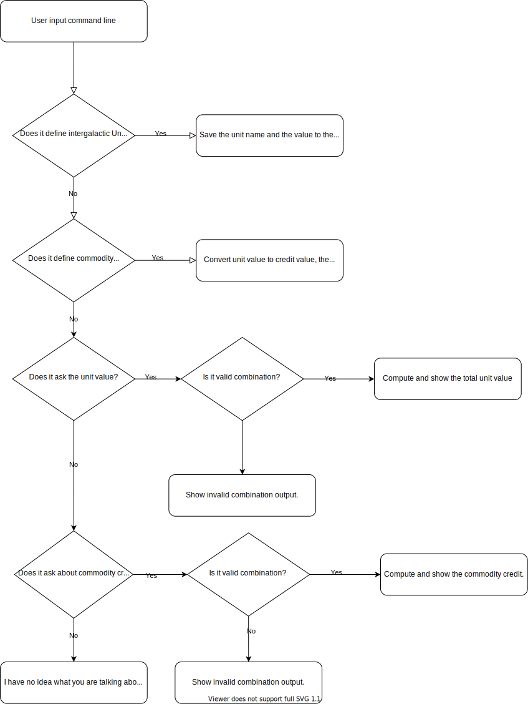
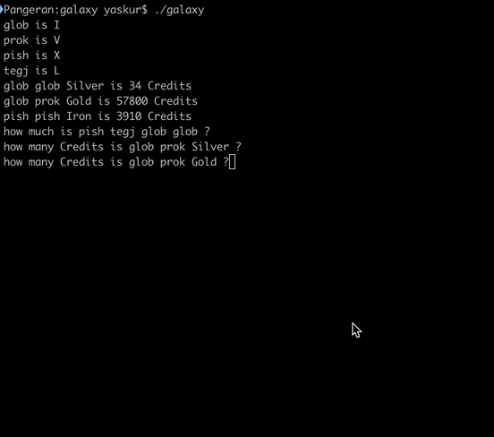

 # GALAXY MERCHANT TRADING GUIDE
## Here is the solution of [CHALLENGE](CHALLENGE.md) which written in Go.

### How to use

- Clone this repository
- Go to the clone directory
- run `go test` to test the solution
- run `go build` to build to executable which will be named **galaxy**
- run `./galaxy < tests/1.in > tests/1.out` to run example input from [CHALLENGE](CHALLENGE.md)
- make sure the output in _tests/1.out_ is same as sample output in [CHALLENGE](CHALLENGE.md)
- run `./galaxy < tests/2.in > tests/2.out` to run second example input
- run `./galaxy < tests/3.in > tests/3.out` to run third example input

### How I solved this [CHALLENGE](CHALLENGE.md) problem
I create the formula pattern of the input line which is consisted of:
- define intergalaxy unit
- define intergalaxy mineral/commodity
- get the intergalaxy unit price (how much question)
- get the intergalaxy mineral/commodity credit (how many question)

I translate every input line using the formula patterns and get the variables groups and compute them then save them int the system.
For the question inputs, system will add output lines that will be printed after the end of the program 

### Nontrivial assumptions
- Intergalaxy units should consist of small letters
- Intergalaxy minerals/commodity should be started with capital letter
- To ask for intergalaxy unit price, you should start with "how much" and end with "?"
- To ask for intergalaxy mineral/commodity credit, you should start with "how many" and end with "?"

### Flow chart

###Demo

